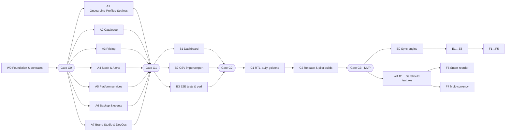

# ShelfWise — Agent Phases (parallel delivery guide)

> How to build **every ShelfWise feature** with several AI coding agents working **in parallel**, each in its own terminal and git worktree, without stepping on each other.
>
> Read with: [`PLAN.md`](./PLAN.md) (what & when) · [`TECHNICAL_STRUCTURE.md`](./TECHNICAL_STRUCTURE.md) (how) · [business & features plan](https://claude.ai/code/artifact/81eac84a-52d7-4261-a5bd-330b71db7270) (why).
> Each agent gets **one brief** from [`agent-briefs/`](./agent-briefs/) plus this file. Nothing else is needed to start.

---

## 1. How parallel work stays safe

Parallel agents break things in three ways: two agents edit the same file, one agent changes a contract the others depend on, or one waits for code that doesn't exist yet. This plan prevents all three.

1. **Contracts first (Wave 0, one agent).** The lead agent writes every shared thing before anyone else starts: the DB schema, entities, repository interfaces, the permission, flag, event and route enums, platform service interfaces, the router aggregator, test helpers, and *all* dependencies in `pubspec.yaml`. These are then **frozen**.
2. **Strict ownership.** Every file path and every DB table/column has exactly one owner (§5). Agents write only inside what they own. They may *read* anything.
3. **Code against interfaces, not implementations.** If Agent A needs something Agent B is building, A uses the W0 interface with the W0 fake. B's real implementation plugs in through a Riverpod provider when merged. No waiting.
4. **No shared hot files.** Translations are per-feature ARB fragments (merged by a script). Routes are per-feature files (aggregated by a file written once in W0). Dependencies are pre-added in W0.
5. **Change requests, not edits.** An agent that needs a contract change writes a request in its handoff report (§9) and continues with a workaround. The lead applies approved changes between waves.

---

## 2. Waves at a glance

| Wave | Agents (parallel inside the wave) | Starts after | Business-plan scope | PLAN.md weeks |
|---|---|---|---|---|
| **W0** Foundation & contracts | `W0` lead (serial, 1 agent) | — | Brand setup, isolation, AR/EN, theming base | Week 1 |
| **W1** MVP features | `A1` Onboarding·Profiles·Settings · `A2` Catalogue · `A3` Pricing · `A4` Stock & Alerts · `A5` Platform services · `A6` Backup & events · `A7` Brand Studio & DevOps | W0 merged + gate G0 | All *Must* features except the dashboard and CSV | Weeks 2–5 |
| **W2** MVP integration features | `B1` Dashboard · `B2` CSV import/export · `B3` Integration tests & seed/perf | W1 merged + gate G1 | Dashboard, CSV import/export, E2E scenario | Weeks 5–7 |
| **W3** Hardening & pilot release | `C1` RTL·a11y·goldens · `C2` Release & pilot builds (lead) | W2 merged + gate G2 | Pilot-ready builds for 3 brands | Week 8 |
| **W4** *Should* features (local) | `D1` Stock count · `D2` Activity log & price history · `D3` Reports · `D4` Multi-branch & transfers · `D5` Suppliers, reorder & POs · `D6` Expiry dates · `D7` Custom roles · `D8` XLSX import & shelf labels · `D9` Native brand apps & custom domain | MVP released (G3) | *Should* list + local-capable *Could* items (sub-waves W4a → W4b, see brief) | After pilot starts |
| **W5** Sync foundation | `E0` Sync engine (serial) → then parallel `E1` Multi-device & invites · `E2` Push & email alerts · `E3` Reseller console · `E4` HQ master catalogue · `E5` Cloud analytics | OD-1 = B, or after W4 | Features that need data across devices | When decided |
| **W6** *Could* features | `F1` API & webhooks · `F2` POS/e-commerce sync · `F3` SSO · `F4` WhatsApp alerts · `F5` In-app billing · `F6` Smart reorder · `F7` Multi-currency | W5 (except F6, F7: after W4) | *Could* list | Post-pilot roadmap |

> **Cost flag.** W0–W4 and E0–E1/E3–E5 fit free tiers (Firebase Spark: Hosting, Firestore, Auth). Anything that **runs server code** (E2 push/email sending, F1, F2, F4, F5) needs Cloud Functions → Firebase **Blaze** plan (billing account required, has a free quota) or another paid service. Those briefs are marked 💳.

---

## 3. Dependency graph



Inside a wave there are **no hard dependencies**. Soft dependencies (e.g. A4 shows product names from A2's tables) are solved by reading the frozen schema and using W0 fakes in tests.

---

## 4. Feature coverage (every feature → one brief)

| Feature (business plan §6) | Priority | Tier | Brief |
|---|---|---|---|
| Brand setup (theming) | Must | All | W0 (runtime) · A7 (Brand Studio) |
| Branded web + installable app | Must | All | A7 (build/deploy/PWA) · C2 (release) |
| Multi-tenant data isolation | Must | All | W0 (schema, `store_id`, per-brand origin) |
| Sign-in & staff invites | Must | All | A1 (local profiles + PIN) · E1 (real invites) |
| Owner & staff roles | Must | All | W0 (permission enum) · A1 (enforcement, guards) |
| Products | Must | All | A2 |
| Categories | Must | All | A2 |
| Price management (single + bulk) | Must | All | A3 |
| Stock levels & movements | Must | All | A4 |
| Low-stock alerts | Must | All | A4 (logic + in-app) · A5 (local notifications) · E2 (push/email) |
| Home dashboard | Must | All | B1 |
| Search & filters | Must | All | A2 |
| CSV/Excel import & export | Must | All | B2 (CSV) · D8 (XLSX) |
| Arabic & English (RTL) | Must | All | W0 (infra) · every agent (own strings) · C1 (audit) |
| Reseller console | Must | All | A7 (Brand Studio, local) · E3 (store management) |
| Barcode scanning | Should → MVP | All | A5 (service) · A2/A4 (flows) |
| Stock count mode | Should | All | D1 |
| Activity log | Should | Aisle+ | D2 |
| Basic reports | Should | All | D3 |
| Offline mode | Should | All | Covered by architecture (local-first). E0 adds offline sync queue. |
| Multi-branch & transfers | Should | Aisle+ | D4 |
| Suppliers & reorder list / POs | Should | Aisle+ | D5 |
| Custom domain & branded email | Should | Aisle+ | D9 (domain) · E2 (email) |
| Own-brand store apps | Should | Aisle+ | D9 |
| Custom roles | Should | Aisle+ | D7 |
| Expiry dates | Should | Aisle+ | D6 |
| HQ master catalogue | Should | Chain | E4 |
| Price history | Could | Aisle+ | D2 |
| Shelf label printing | Could | Aisle+ | D8 |
| WhatsApp alerts | Could | Aisle+ | F4 💳 |
| API & webhooks | Could | Chain | F1 💳 |
| POS & e-commerce sync | Could | Chain | F2 💳 |
| Single sign-on | Could | Chain | F3 |
| Smart reorder suggestions | Could | Chain | F6 |
| In-app billing for brands | Could | All | F5 💳 |
| Multi-currency | Could | Chain | F7 |
| Advanced reports | (Aisle tier) | Aisle+ | D3 |
| Pilot metrics (business plan §9) | — | — | A6 (local events) · E5 (cloud analytics) |
| *Won't in v1:* POS/checkout, accounting & e-invoicing, storefront, payments processing, HR/payroll, warehouse/manufacturing, loyalty/CRM, per-client custom code | Won't | — | **No brief. Agents must not build these.** |

---

## 5. Ownership map

### 5.1 Code paths

| Owner | Writes to | Notes |
|---|---|---|
| **W0 / lead** | `pubspec.yaml`, `analysis_options.yaml`, `build.yaml`, `l10n.yaml`, `lib/main.dart`, `lib/bootstrap.dart`, `lib/app.dart`, `lib/core/**` (except the sub-folders below), `lib/core/router/feature_routes.dart`, `test/helpers/**`, `assets/fonts/**`, `assets/brands/shelfwise/**`, `assets/brands/demo-green/**`, `tools/scripts/merge_arb.dart` | Only the lead edits these after W0 (via change requests) |
| A1 | `lib/features/onboarding/**`, `lib/features/profiles/**`, `lib/features/settings/**`, `lib/core/session/session_impl.dart`, `lib/core/settings/preferences_impl.dart` | Replaces both W0 stubs (session + preferences) |
| A2 | `lib/features/categories/**`, `lib/features/products/**` | |
| A3 | `lib/features/pricing/**` | |
| A4 | `lib/features/stock/**`, `lib/features/alerts/**` | |
| A5 | `lib/core/platform/impl/**` | Interfaces stay in `lib/core/platform/*.dart` (W0); replaces `platform_providers.dart` stub |
| A6 | `lib/features/backup/**`, `lib/core/analytics/impl/**` | Replaces `analytics_impl.dart` stub; backup screen linked from settings via route constant |
| A7 | `tools/brand_studio/**`, `tools/scripts/build_brand.sh`, `tools/scripts/deploy_brand.sh`, `tools/scripts/gen_pwa_manifest.dart`, `firebase.json`, `.firebaserc`, `.github/workflows/**`, `web/index.html`, `web/manifest.json` | |
| B1 | `lib/features/dashboard/**` | |
| B2 | `lib/features/import_export/**` | |
| B3 | `integration_test/**`, `tools/scripts/seed_db.dart`, `assets/seed/**`, `test/perf/**` | |
| C1 | `test/goldens/**`, fixes anywhere **only** as small PRs reviewed by the owner or lead | |
| D*/E*/F* | Their own `lib/features/<feature>/**` as named in each brief | Schema changes arrive via lead-written migrations |

Everyone owns their own tests under `test/features/<feature>/**` and their own translation fragments under `lib/features/<feature>/l10n/`.

### 5.2 Database tables (write ownership; everyone may read)

| Table / columns | Writer |
|---|---|
| `stores`, `branches`, `profiles`, `settings` | A1 |
| `categories`; `products` (all columns **except** `price_minor`, `cost_minor`, `reorder_point_milli`); `product_images` | A2 |
| `products.price_minor`, `products.cost_minor`; `price_changes` | A3 (A2 sets initial price/cost on **create** only) |
| `products.reorder_point_milli`; `stock_levels`; `stock_movements`; `stock_alerts` | A4 |
| `app_events` | A6 (via `AnalyticsService`; any agent *logs* through the service) |
| All tables (restore only) | A6 `RestoreBackup` — the only cross-table writer, inside one transaction |
| Bulk inserts from import | B2, **through A2/A3/A4 repositories** (no direct SQL on their tables) |

### 5.3 Translation keys

Keys are prefixed by owner: `common_*` (W0), `onboarding_*` `profiles_*` `settings_*` (A1), `catalogue_*` (A2), `pricing_*` (A3), `stock_*` `alerts_*` (A4), `backup_*` (A6), `platform_*` (A5, in `lib/core/platform/impl/l10n/`), `dashboard_*` (B1), `import_*` (B2). Each agent edits only `lib/features/<feature>/l10n/<feature>_en.arb` and `_ar.arb`. `tools/scripts/merge_arb.dart` builds `lib/core/l10n/arb/app_{en,ar}.arb` (generated but **committed**, because `flutter pub get`/`build` need it; never hand-edit). Then run `flutter gen-l10n`. The Dart output in `lib/core/l10n/gen/` is git-ignored.

---

## 6. Frozen contracts (written in W0)

After gate G0 these files change **only** through a lead-approved change request:

| Contract | File(s) |
|---|---|
| DB schema v1 + migration runner | `lib/core/database/schema/**`, `lib/core/database/migrations/m001_initial.dart` |
| Value objects | `lib/core/utils/money.dart`, `quantity.dart`, `ids.dart`, `clock.dart` |
| Result & failures | `lib/core/error/**` |
| Brand, tiers & flags | `lib/core/brand/**` (`BrandConfig`, `Tier`, `FeatureFlag`, `FeatureFlags`) |
| Permissions | `lib/core/auth/permission.dart` (enum + default role matrix) |
| Session | `lib/core/session/session_reader.dart` (`SessionReader` + `SessionState`), `entities/{store,branch,profile}.dart`, `fake_session.dart`; provider `sessionControllerProvider` in `session_impl.dart` (A1 replaces the body, keeps name/type) |
| Preferences | `lib/core/settings/app_preferences.dart`, `effective_locale.dart`; provider `preferencesControllerProvider` in `preferences_impl.dart` (A1 replaces the body) |
| Entities & repository interfaces for all W1/W2 features | `lib/features/<f>/domain/entities/**`, `lib/features/<f>/domain/repositories/**` |
| Platform services | `lib/core/platform/{scanner,notification,file}_service.dart` + fakes |
| Analytics events | `lib/core/analytics/app_event.dart` (enum of event names + props) + `analytics_service.dart` |
| Routes | `lib/core/router/route_paths.dart` (all path constants) + `feature_routes.dart` (imports each feature's `presentation/routes.dart`) |
| DB change signal | `lib/core/database/db_changes.dart` (`DbTable` enum + `dbChangesProvider`) |
| Theme tokens | `lib/core/theme/stock_colors.dart`, `spacing.dart` |
| Public surfaces | `lib/features/<f>/public.dart` — the only cross-feature import besides `domain/` (symbols listed in the W0 brief) |
| Test helpers | `test/helpers/{test_db,test_app,fixtures,fake_*}.dart` |

Agents **implement** their own repositories and **consume** others' `domain/` interfaces and `public.dart` symbols; they never edit another feature's files. Implementation stubs (`session_impl.dart`, `platform_providers.dart`, `analytics_impl.dart`) are created in W0 and **replaced** by A1, A5 and A6 — so no one edits `bootstrap.dart`.

---

## 7. Rules for every agent (paste-proof)

1. Read `AGENT_PHASES.md`, your brief, and the sections of `TECHNICAL_STRUCTURE.md` it points to. Nothing else is required.
2. Work only in **your worktree and branch** (`agent/<ID>-<slug>`). Rebase on `main` before opening the PR.
3. Write only to paths and tables you own (§5). Reading is fine.
4. Do not edit frozen contracts (§6), `pubspec.yaml`, or another feature's files. Need a change? Add it to *Change requests* in your report, use a local workaround, and keep going.
5. Clean Architecture rules (TECHNICAL_STRUCTURE §3): no Flutter/sqflite imports in `domain/`, no SQL outside `data/datasources/`, UI calls use cases only. From another feature import only its `domain/` or `public.dart`.
6. Riverpod with codegen (`@riverpod`), `freezed` for entities/state. Run `dart run build_runner build -d`.
7. Every user-facing string goes in your ARB fragment (en **and** ar). Use `EdgeInsetsDirectional` and `start`/`end`. Money via `Money`, quantities via `Quantity`.
8. Every write use case: checks `Permission` + `FeatureFlag`, runs in one transaction, emits `dbChanges`, logs its `AppEvent`.
9. Tests are part of the task: unit (use cases), repository (in-memory DB), widget (main screens, LTR + RTL).
10. Before finishing: `dart run tools/scripts/merge_arb.dart && flutter gen-l10n && flutter analyze && flutter test` all green. Then write your report (§9).
11. Don't build anything listed as *Won't*. Don't add features not in your brief. If the brief is ambiguous, choose the simplest option that meets the acceptance criteria and note it in the report.

---

## 8. Running agents in sub-terminals

### Setup (once, after W0 is merged)

```bash
cd shelfwise
# one worktree + branch per agent in the wave
for id in A1-onboarding A2-catalogue A3-pricing A4-stock A5-platform A6-backup A7-devops; do
  git worktree add ../sw-$id -b agent/$id main
done
```

### Launch (one terminal / tmux pane per agent)

```bash
cd ../sw-A2-catalogue
claude "You are agent A2. Read .claude/AGENT_PHASES.md and .claude/agent-briefs/W1-A2-catalogue.md, \
then implement the brief completely. Follow the rules in section 7 strictly. \
When done, write .claude/agent-reports/A2.md using the template in section 9."
```

Tip: `tmux new-session -d -s sw` then `tmux split-window` per agent, or open one terminal tab per worktree.

### Wave checklist for the lead

1. Confirm the gate for the previous wave passed (§10).
2. Create worktrees for the wave and launch agents.
3. Answer change requests as they appear in reports. Batch contract changes into one lead PR between waves (bump migration version if schema changes).
4. Merge PRs in the order given in §10. Re-run all tests after each merge.
5. Remove worktrees: `git worktree remove ../sw-<id>`.

---

## 9. Handoff report template (`.claude/agent-reports/<ID>.md`)

```markdown
# <ID> — <brief title> — handoff

## Status
Done / Partially done (what's missing and why)

## What I built
- Use cases: …
- Screens/routes: …
- Tables written: …

## Files
Created: … · Modified: … (must all be inside my owned paths)

## Tests
Unit: n · Repository: n · Widget: n · All green: yes/no
How to try it manually: …

## Decisions I made (brief was ambiguous)
- …

## Change requests (for the lead)
| Contract/file | Change needed | Why | Workaround used |
|---|---|---|---|

## Known issues / follow-ups
- …
```

---

## 10. Gates & merge order

| Gate | Merge order | Must pass |
|---|---|---|
| **G0** (after W0) | W0 single PR | App boots on Android, iOS sim, Chrome, Windows, macOS; brand switch via `--dart-define`; light/dark; AR/EN RTL; migration creates schema v1; every feature route shows a placeholder; all fakes compile; `flutter analyze` clean; contracts reviewed by a human |
| **G1** (after W1) | A5 → A7 → A1 → A2 → A3 → A4 → A6 | Onboard → create product → set price → receive stock → low-stock alert appears; staff profile blocked from pricing (UI **and** URL); backup → restore round-trip; a brand created in Brand Studio deploys to a preview channel |
| **G2** (after W2) | B1 → B2 → B3 | Dashboard reflects changes live; 1,000-row CSV imports with error preview; E2E scenario green on Android + Chrome; 5,000-product search < 150 ms on low-end Android |
| **G3** (MVP) | C1 → C2 | PLAN.md §8 release checklist passes for all 3 pilot brands |
| G4 (W4) | D-agents in any order; migrations numbered by the lead in merge order | Each feature hidden when its tier flag is off; migrations upgrade a pilot backup cleanly |
| G5 (W5) | E0 first and alone, then E1–E5 | Two devices converge after offline edits; no cross-store data leakage (security rules tests) |
| G6 (W6) | Any order | Per brief |

---

## 11. Brief index

| ID | Brief | Wave |
|---|---|---|
| W0 | [Foundation & contracts](./agent-briefs/W0-foundation.md) | 0 |
| A1 | [Onboarding, profiles & settings](./agent-briefs/W1-A1-onboarding-profiles-settings.md) | 1 |
| A2 | [Catalogue: categories, products, search](./agent-briefs/W1-A2-catalogue.md) | 1 |
| A3 | [Pricing](./agent-briefs/W1-A3-pricing.md) | 1 |
| A4 | [Stock movements & low-stock alerts](./agent-briefs/W1-A4-stock-alerts.md) | 1 |
| A5 | [Platform services](./agent-briefs/W1-A5-platform-services.md) | 1 |
| A6 | [Backup, restore & pilot events](./agent-briefs/W1-A6-backup-events.md) | 1 |
| A7 | [Brand Studio, build & deploy](./agent-briefs/W1-A7-brand-studio-devops.md) | 1 |
| B1 | [Dashboard](./agent-briefs/W2-B1-dashboard.md) | 2 |
| B2 | [CSV import & export](./agent-briefs/W2-B2-csv-import-export.md) | 2 |
| B3 | [E2E tests, seed data & performance](./agent-briefs/W2-B3-e2e-seed-perf.md) | 2 |
| C1 | [RTL, accessibility & goldens](./agent-briefs/W3-C1-rtl-a11y-goldens.md) | 3 |
| C2 | [Release & pilot builds](./agent-briefs/W3-C2-release.md) | 3 |
| D1–D9 | [Should features](./agent-briefs/W4-should-features.md) | 4 |
| E0–E5 | [Sync & connected features](./agent-briefs/W5-sync.md) | 5 |
| F1–F7 | [Could features](./agent-briefs/W6-could-features.md) | 6 |
